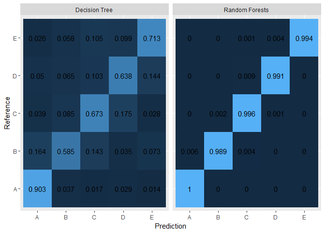

# Prediction Assignment
Dave Nair  
June 1, 2017  

# Pre-Processing


```r
knitr::opts_chunk$set(echo = TRUE, results = 'markup',
                      warning = FALSE, message = FALSE,
                      cache = TRUE)
library(ggplot2); library(lattice); library(caret)
library(rpart); library(randomForest)

if(!file.exists('pml-training.csv')){
    download.file("https://d396qusza40orc.cloudfront.net/predmachlearn/pml-training.csv",
                  destfil="./pml-training.csv")}
if(!file.exists('pml-testing.csv')){
    download.file("https://d396qusza40orc.cloudfront.net/predmachlearn/pml-testing.csv",
                  destfil="./pml-testing.csv")}

train <- read.csv('pml-training.csv', na.strings = c('NA','NAN','#DIV/0!','NaN',''))
test <- read.csv('pml-testing.csv', na.strings=c('NA','NAN','#DIV/0!','NaN',''))

set.seed(12345)
```

I'm only going to keep columns with *mostly* non-NA information (more than 50%). As we'll see, this actually accounts for all NA values in both datasets. Note that I am selecting the columns for both `train` and `test`, based on columns only from the `train` data to keep my matrices consistent. 


```r
test <- test[colMeans(!is.na(train))>0.5]
train <- train[colMeans(!is.na(train))>0.5]
sum(is.na(train))==0; sum(is.na(test))==0
```

```
## [1] TRUE
```

```
## [1] TRUE
```

```r
names(train)
```

```
##  [1] "X"                    "user_name"            "raw_timestamp_part_1"
##  [4] "raw_timestamp_part_2" "cvtd_timestamp"       "new_window"          
##  [7] "num_window"           "roll_belt"            "pitch_belt"          
## [10] "yaw_belt"             "total_accel_belt"     "gyros_belt_x"        
## [13] "gyros_belt_y"         "gyros_belt_z"         "accel_belt_x"        
## [16] "accel_belt_y"         "accel_belt_z"         "magnet_belt_x"       
## [19] "magnet_belt_y"        "magnet_belt_z"        "roll_arm"            
## [22] "pitch_arm"            "yaw_arm"              "total_accel_arm"     
## [25] "gyros_arm_x"          "gyros_arm_y"          "gyros_arm_z"         
## [28] "accel_arm_x"          "accel_arm_y"          "accel_arm_z"         
## [31] "magnet_arm_x"         "magnet_arm_y"         "magnet_arm_z"        
## [34] "roll_dumbbell"        "pitch_dumbbell"       "yaw_dumbbell"        
## [37] "total_accel_dumbbell" "gyros_dumbbell_x"     "gyros_dumbbell_y"    
## [40] "gyros_dumbbell_z"     "accel_dumbbell_x"     "accel_dumbbell_y"    
## [43] "accel_dumbbell_z"     "magnet_dumbbell_x"    "magnet_dumbbell_y"   
## [46] "magnet_dumbbell_z"    "roll_forearm"         "pitch_forearm"       
## [49] "yaw_forearm"          "total_accel_forearm"  "gyros_forearm_x"     
## [52] "gyros_forearm_y"      "gyros_forearm_z"      "accel_forearm_x"     
## [55] "accel_forearm_y"      "accel_forearm_z"      "magnet_forearm_x"    
## [58] "magnet_forearm_y"     "magnet_forearm_z"     "classe"
```

Since our primary question is to consider the excercises and their execution, I will ignore timestamp data (including window data) and any data concerning the subject's identity.


```r
test <- test[,8:ncol(train)]
train <- train[,8:ncol(train)]
```

Lastly, to help us select which model to use, let's split the `train` dataset into training and cross-validation sets (`train` and `cv`, respectively).


```r
cvPartition <- createDataPartition(y=train$classe,
                                   p=0.75,
                                   list=FALSE)
cv <- train[-cvPartition,]
train <- train[cvPartition,]
dim(train); dim(cv); dim(test)
```

```
## [1] 14718    53
```

```
## [1] 4904   53
```

```
## [1] 20 53
```

# Training and Cross-Validating

We'll be training a decision-tree model as well as a random-forests model.


```r
model.DecisionTree <- rpart(classe~., data=train, method='class')
model.RandomForests <- randomForest(classe~., data=train, na.action=na.omit)
```

Next, we'll use these models to predict the classifications for the cv set. After that, we'll compare the models using confusion matrices.


```r
prediction.DecisionTree <- predict(model.DecisionTree,
                                   cv, type='class')

prediction.RandomForests <- predict(model.RandomForests,
                                    cv, type='class')

confusion.DecisionTree <- confusionMatrix(prediction.DecisionTree, cv$classe)
confusion.RandomForests <- confusionMatrix(prediction.RandomForests, cv$classe)
```

## Comparing Models

Below are the comparisons of how well the two models can predict the `classe` variable of the `cv` dataframe.


```r
df.DecisionTree <- as.data.frame(confusion.DecisionTree$table)
df.RandomForests <- as.data.frame(confusion.RandomForests$table)

NormalizeFrequency <- function(Iter,Dataframe){
    Dataframe[Iter,'Freq']/sum(subset(Dataframe, Reference==Dataframe[Iter,'Reference'])$Freq)
}

df.DecisionTree$NormFreq <- sapply(1:nrow(df.DecisionTree), 
                                   function(x) NormalizeFrequency(x,df.DecisionTree))
df.RandomForests$NormFreq <- sapply(1:nrow(df.RandomForests), 
                                    function(x) NormalizeFrequency(x,df.RandomForests))

df.DecisionTree$Model <- rep('Decision Tree',nrow(df.DecisionTree))
df.RandomForests$Model <- rep('Random Forests',nrow(df.RandomForests))

df.Models <- rbind(df.DecisionTree, df.RandomForests)

ggplot(data=df.Models, aes(x=Prediction, y=Reference, fill=NormFreq)) + 
    geom_tile() + 
    facet_grid(~Model) +
    guides(fill=FALSE) +
    geom_text(aes(x=Prediction, y=Reference,
                  label=round(NormFreq,3)))
```

<!-- -->

Clearly, the model using Random Forests is better able to predict for all 5 classifications. As such, we will proceed by predicting and comparing the `test` set.

# Predicting the Test Set

Using the same procedure as before and our `model.RandomForests` model, we can then make predictions for the test set classifications:


```r
finalPrediction <- predict(model.RandomForests, 
                           test, type='class')

finalPrediction
```

```
##  1  2  3  4  5  6  7  8  9 10 11 12 13 14 15 16 17 18 19 20 
##  B  A  B  A  A  E  D  B  A  A  B  C  B  A  E  E  A  B  B  B 
## Levels: A B C D E
```

# Acknowledgements

I'd like to thank Ugulino, W.; Cardador, D.; Vega, K.; Velloso, E.; Milidiu, R.; and Fuks, H.; all of whom made this dataset and analyses possible.

Read more about their study here: http://groupware.les.inf.puc-rio.br/har#ixzz4j9Jb8hbi.
